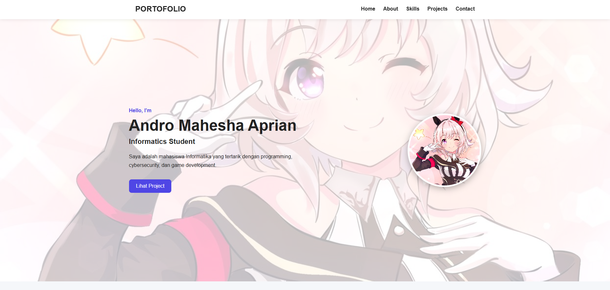
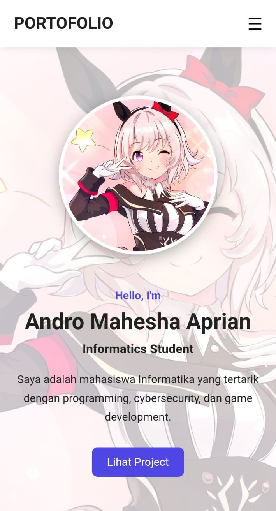

# Portfolio Website

Website portfolio pribadi yang dibuat menggunakan HTML, CSS, dan JavaScript.

## Deskripsi

Website ini dibuat sebagai tugas slicing website dengan desain portfolio sederhana dan responsive. Website menampilkan informasi diri, skills, project, serta contact yang dapat digunakan untuk menghubungi pemilik portfolio.

## Teknologi

- HTML
- CSS
- JavaScript


## Screenshot

### Desktop



### Mobile



## Struktur Folder

```text
portfolio/
├── index.html
├── style.css
├── script.js
├── curren.jpg
└── screenshots/
    ├── desktop.png
    ├── tablet.png
    └── mobile.png
